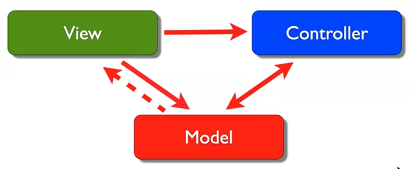
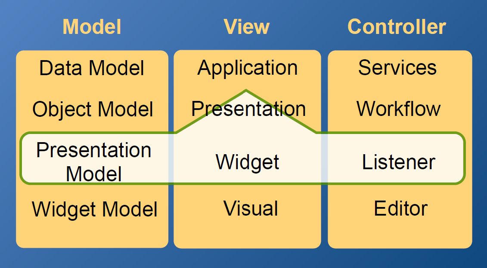

# webcl-hs20
module web clients fall semester 2020

Das Drehbuch ist in drei Teile gegliedert:
> - UI Architecture (W1-W5)
> - Custom UI Elements (W5-W10) 
> - Remoting (W11-W15)

**Evaluation:**
> Punkte sammeln durch Beiträge im Unterricht. Sei es durch Fragen stellen oder beantworten.  
50 Punkte = 6.0, 60% von den Punkten sind notwendig um das Modul zu bestehen.  
Punkte sind individuell auf MS Teams einzutragen unter *Notizen* im jeweiligen Wochen-Channel. 

## week1 Anschluss an WebPr finden

**Inhalt der Vorlesung**
> Philosophie vom ModelViewController (MVC) repetiert  
Ziel 1: View, Controller und Model sind vollständig voneinander getrennt  
Ziel 2: alle Views sind vollständig voneinander getrennt

**SimpleTodoAppwithMVC**
> https://webengineering-fhnw.github.io/webcl-hs20/week1/todo/View.html

**Beantwortete Fragen zum Inhalt**
> - Wir werden kein Framework benutzen
> - Wir werden nicht auf die Unterschiede von den verschiedenen Frameworks eingehen.
> - Progressive WebApplication (PWA) ist normalerweise Teil vom Modul Web Programming, könnte aber in Woche 10 aufgegriffen werden, falls das Interesse da ist 
> - PWA ist auch ein Webclient
> - CSS++ steht für fortschrittliche Nutzung von CSS
> - Für Web Client werden wir nur JavaScript anschauen. Keine weitere Programmiersprachen
> - Was gilt als dependency? "Wenn du die Kontrolle über deinen Code hast, dann bist du nicht abhängig.Ein selbst gebautes Framework ist keine Abhängigkeit
> - Wir werden nich auf die Abhängigkeiten der unterschiedlichen Browser und Browser-Versionen näher eingehen
> - Wir werden nicht behandeln wie man eine Web Applikation responsive macht. --> WebEngineering
> - Wir werden automatisierte Tests anschauen
> - Es ist nicht nötig das Projekt zu forken. Man kann einfach mitprogrammieren und danach die Änderungen mit dem Code vom Herrn König überschreiben indem man den aktuellen Code vom Master-Branch pullt 
> - Kein eigentlicher Unterschied zu const Observable = v => {} und function Observable (v) {} - das Erste ist jedoch stabiler 

## week2 Validationen, Konvertierungen, Attribute

**Inhalt der Vorlesung**
> CSS Goodie
> MVC im Detail erklärt  
> Tests angeschaut (failling tests on purpose)

TODO: Link einfügen

**CSSGoodie**
> Wichtig! Es ist egal was wir im CSS machen es wird den html DOM nicht beeinflussen.
> CSS kümmert sich nur um die Darstellung und verändert die Struktur nicht.

**MVC Kommunikation**  

> - Model kennt den View nur indirekt. Bei einer Änderung werden alle Klassen, die sich beim Model registriert haben, informiert. Kennt sonst keine Spezialisierungen von den Views
> - View: Nach einer Änderungsmitteilung greift es auf das Model zu. Den Zugriff bekommt er über den Controller. Bei einer Änderung benachrichtigt es den Controller.
> - Controller: Benachrichtigt das Model über die Änderung im View  
> Falsche Verwendung: Jeder kennt jeden und jeder wird über alles benachrichtigt.  
> Für den Programmierer ist es dann kaum mehr nachvollziehbar, wenn ein Fehler auftritt.
>

**MVC Beispiel an einer Organisation zB FHNW**

> Model: Menge aller Datenbanken, die man hat  
> Views: Die verschiedenen Applikationen, die zur Verfügung gestellt wird: Evento, etc.  
> Controller: Services, die bereit gestellt wird, die drauf operieren. Sind meistens versteckt im Hintergrund  
> Und jeder von den Dreien, gliedern sich wieder auf in Model View Controller.  
> Zoom auf den View  
> 
> Der View gliedert sich dann wieder in einer MVC-Struktur, wobei M: Object Model, V: Presentasion, C: Workflow

**Testing**
> Tests failing on purpose --> um zu sehen was zu implementieren ist  
> Test mit Debugger laufen lassen --> presentationModelTest
> * setConverter
> * setConvertedValue
> * setValidator  
> Am Ende vom Testing kontrollieren, ob der View auch noch funktioniert!

**Spezialaufgabe: Unterschied *innerText & textContent***
> TextContent rendert genau das was geschrieben ist und ignoriert html tags oder css selektoren.  
> Es ist performanter gegenüber innerText.  
> Wenn man ein Text setzen will, unanhängig von der Darstellung, dann sollte man textContent nehmen.

**Spezialaufgabe: Konvertierung & Validierung**
> 2 verschiedene Varianten  
> - V1: validierung bei der onchange methode eingefügt. invalide Inputs als invalid anzeigen, valide inputs zu uppercase ändern  
> [Version 1](https://fhnw365-my.sharepoint.com/personal/benjamin_huber_students_fhnw_ch/_layouts/15/onedrive.aspx?id=%2Fpersonal%2Fbenjamin%5Fhuber%5Fstudents%5Ffhnw%5Fch%2FDocuments%2FMicrosoft%20Teams%20Chat%20Files%2Ftodo%5Fv1%2Ejs&parent=%2Fpersonal%2Fbenjamin%5Fhuber%5Fstudents%5Ffhnw%5Fch%2FDocuments%2FMicrosoft%20Teams%20Chat%20Files&originalPath=aHR0cHM6Ly9maG53MzY1LW15LnNoYXJlcG9pbnQuY29tLzp1Oi9nL3BlcnNvbmFsL2JlbmphbWluX2h1YmVyX3N0dWRlbnRzX2ZobndfY2gvRVM5S0ZSZXdCdHhCczRxaE1vdDVUV0lCbFpSdGJjMGxyMlRaWkd4QlFCRnBMdz9ydGltZT1LUkJjMTVSdTJFZw)
> - V2: validierung bei der Methode onTextChanged. Unterschied: Texte sind von Anfang an validiert und konvertiert  
> [Version 2](https://fhnw365-my.sharepoint.com/personal/benjamin_huber_students_fhnw_ch/_layouts/15/onedrive.aspx?id=%2Fpersonal%2Fbenjamin%5Fhuber%5Fstudents%5Ffhnw%5Fch%2FDocuments%2FMicrosoft%20Teams%20Chat%20Files%2Ftodo%5Fv2%2Ejs&parent=%2Fpersonal%2Fbenjamin%5Fhuber%5Fstudents%5Ffhnw%5Fch%2FDocuments%2FMicrosoft%20Teams%20Chat%20Files&originalPath=aHR0cHM6Ly9maG53MzY1LW15LnNoYXJlcG9pbnQuY29tLzp1Oi9nL3BlcnNvbmFsL2JlbmphbWluX2h1YmVyX3N0dWRlbnRzX2ZobndfY2gvRVNBSWlveDBqM05Db0RrNnJVdllTVm9Cd2FiVlRMQ1FOUFR2c1I4R3pCU0hmZz9ydGltZT1wbGtBOFpSdTJFZw)

**IntelliJ Tipps&Tricks**
> Eine Expression evaluieren: Alt+F8
> CSS Validierung: Rechts-Klick > Debug  
> TODO:Insert Link from original repo
> Bookmarks setzen: Shift + F11

**Beantwortete Fragen zum Inhalt**
> - Sind die Modelle und Controller untereinander auch getrennt: Ja. Was sein kann, ist das eine Komponente, die aus MVC besteht mit mehreren Controllern kommunizieren kann.  
> - Mit welcher Schicht sollte man am besten ein neues Projekt beginnen? --> Gehe vom Bekannten zum Unbekannten. Mit dem was man kennt anfangen und die Anderen kommen drum rum.  
> - Wir werden sass nicht behandeln
> - *Observierbar* heisst, das wir die Änderungen mitbekommen